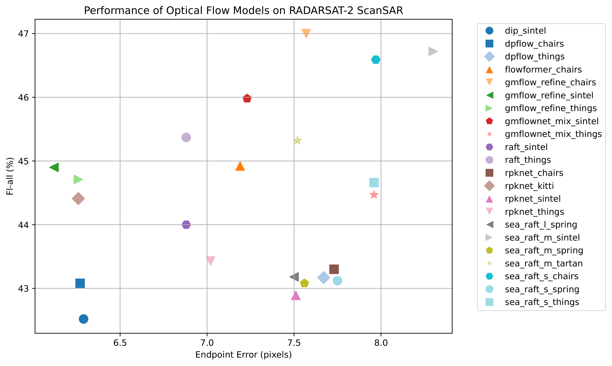

# Sea Ice Drift Estimation with Deep Learning Optical Flow on RADARSAT-2


[](https://pytorch.org/)
[](https://lightning.ai/docs/pytorch/stable/)


This work was presented at the NeurIPS 2025 Workshop on Machine Learning and the Physical Sciences (ML4PS).

This repository provides the code and evaluation pipeline used in the paper: "**Towards Reliable Sea Ice Drift Estimation in the Arctic: Deep Learning Optical Flow on RADARSAT-2**"

The project benchmarks deep learning optical flow models for estimating **sea ice drift** from **RADARSAT-2 ScanSAR imagery**, evaluated against **GNSS-tracked buoys**. The repository includes tools to run inference with multiple optical flow models, compute evaluation metrics using sparse buoy observations, and analyze the resulting motion fields.

📄 [Paper](https://arxiv.org/abs/2510.26653)

📦 [Dataset](https://doi.org/10.5281/zenodo.19057988)

---

# Overview

Accurate estimation of sea ice drift is critical for **Arctic navigation, climate research, and operational forecasting**. While **optical flow**—a computer vision technique for estimating pixel-wise motion between consecutive images—has advanced rapidly in computer vision, its application to **satellite SAR imagery** remains limited.

Classical optical flow methods rely on strong mathematical assumptions that often break down in complex geophysical environments. Recent **deep learning–based optical flow models** have significantly improved motion estimation accuracy and are now the standard in computer vision.

This repository evaluates **48 deep learning optical flow models** on **RADARSAT-2 ScanSAR sea ice imagery**, using **GNSS buoy observations as ground truth**.

Key results show that several models achieve **sub-kilometer drift accuracy**, demonstrating that modern optical flow methods can be successfully transferred to polar remote sensing applications.

---

# Key Features

- Benchmark of **48 deep learning optical flow models**
- Evaluation using **RADARSAT-2 ScanSAR imagery**
- Validation with **GNSS-tracked sea ice buoys**
- Support for **sparse ground truth evaluation**
- Standardized output flow fields (`.flo` format) and images for visualization (`.png` format)
- Tools for computing **Endpoint Error (EPE)** and **Fl-all** metrics

---

# Dataset

The dataset consists of:
- **Ground truth buoy observations** used for sea ice drift. The values are given in pixels, with respect to the center of each image.
- Derived **optical flow fields** produced by multiple models
- Two input image samples (`.png` format) to ease comparison.

---

# Installation

1. Clone the repository:

2. Create the environment:

```bash
mamba create -n ptlflow python=3.12
mamba activate ptlflow
```

3. Install dependencies:

```bash
pip install -r requirements.txt
```

---

# Quick Start

1. Install the environment
2. Prepare input images and buoy ground truth
3. Configure the inference settings
4. Run multi-model inference

---

# Expected Folder Structure

Inputs must follow the directory structure below.

```
project_root/
└── inputs/
    │
    └── experiment_name/
        ├── images/
        │   ├── image_1.tif│.png│.jpg
        │   ├── ...
        │   └── image_n.tif│.png│.jpg
        └── ground_truth/
            └── buoy_type/
                ├── buoys_x.csv
                └── buoys_y.csv
```

```
# Note that you do not have to create the outputs' folder structure, this is only for reference, so you are familiarized with the outputs you should get.

project_root/
└── outputs/
    │
    └── experiment_name/
        ├── model_name_1/
        │   ├── flows/
        │   │   └── images/
        │   │       ├── flo_file_1.flo
        │   │       ├── ...
        │   │       └── flo_file_n.flo
        │   ├── flows_viz/
        │   │    └── images/
        │   │       ├── image_1.png
        │   │       ├── ...
        │   │       └── image_n.png
        │   └── metrics_per_buoy_type.csv # These are metrics per image and experiment experiments
        ├── ...
        ├── model_name_n/
        │   ├── flows/
        │   │   └── images/
        │   │       ├── flo_file_1.flo
        │   │       ├── ...
        │   │       └── flo_file_n.flo
        │   ├── flows_viz/
        │   │    └── images/
        │   │       ├── image_1.png
        │   │       ├── ...
        │   │       └── image_n.png
        │   └── metrics_per_buoy_type.csv
        └── metrics_per_buoy_type.csv # These are global metrics, summary from all experiments
```

Important:
* **Image pairs and ground truth references must share the same base name.**
* Ground truth must be provided in **pixel coordinates**.

---

# Input Data Format

## Images

Two SAR images representing consecutive acquisitions of the same region. All the images must share the number of pixels (e.g. spatial resolution.)

Example:

```
scene_001_1.tif
scene_001_2.tif
```

---

## Ground Truth (Sparse Buoys)

Ground truth is provided as **GNSS buoy positions projected into pixel coordinates**.

Required files:

```
buoys_x.csv
buoys_y.csv
```

These contain the buoy displacement components along each axis.

**Important:**
The evaluation metrics implemented in this repository are designed specifically for **sparse buoy observations**.

---

# Running Inference

Inference across multiple optical flow models is controlled through a configuration dictionary.

Customize the configuration in the inference script or config file before running.

Example command:

```bash
python infer_multi_model.py --config configs/config.yaml
```

The script will:

1. Load SAR image pairs
2. Run inference using multiple optical flow models (the ones defined in config.yaml)
3. Save predicted flow fields
4. Compute evaluation metrics against buoy ground truth

---

# Outputs

The pipeline produces several outputs:

### Optical Flow Fields
Each file corresponds to a predicted motion field between two SAR images. Optical flow outputs are stored using the `.flo` format.

Each file contains a 3-dimensional array:

```
H × W × 2
```

Where:

* `H` = image height
* `W` = image width

Channels represent displacement in pixels:

```
flow[y, x, 0] → horizontal displacement (dx)
flow[y, x, 1] → vertical displacement (dy)
```

Units: **pixels**

This means the flow provides the predicted motion vector for **every pixel in the image**.

---

# Evaluation Metrics

The repository computes two standard optical flow metrics:

### Endpoint Error (EPE)

Average Euclidean distance between predicted and ground truth displacement vectors.

### Fl-all

Percentage of flow vectors whose error exceeds a defined threshold.

Evaluation is performed **only at buoy locations**, since ground truth is sparse.

---

# Benchmark Results

The benchmark evaluates **48 optical flow models** on RADARSAT-2 sea ice imagery.

Several models achieve:

* **EPE ≈ 6–8 pixels**
* **≈ 300–400 meters drift error**

This level of accuracy is small relative to typical spatial scales of Arctic sea ice motion.

---

# Scatterplot of Models' Performance

The figure below shows the relationship between optical flow model performance metrics for the top tested models.



---
# Citation

If you use this repository or dataset, please cite:

```
@article{martin2025towards,
  title={Towards Reliable Sea Ice Drift Estimation in the Arctic Deep Learning Optical Flow on RADARSAT-2},
  author={Martin, Daniela and Gallego, Joseph},
  journal={arXiv preprint arXiv:2510.26653},
  year={2025}
}
```

```
@dataset{martin2026arctic,
  author       = {Martin, D. and Gallego, J.},
  title        = {Arctic Sea Ice Motion Dataset: RADARSAT-2 ScanSAR Images and Sparse GNSS Buoy Observations},
  year         = {2026},
  publisher    = {Zenodo},
  doi          = {10.5281/zenodo.19057988},
  url          = {https://doi.org/10.5281/zenodo.19057988},
  note         = {NeurIPS 2025 Workshop on Machine Learning and the Physical Sciences (NeurIPS-ML4PS), San Diego, California},
  type         = {Data set}
}
```

---

# License

This project is released under the **MIT License**.

---

# Acknowledgements

The authors acknowledge the U.S. National Ice Center for providing RADARSat-2 imagery used in this study. Ground truth data were provided by multiple collaborating institutions, as cited in the text. Due to data usage restrictions, the satellite imagery cannot be publicly shared.